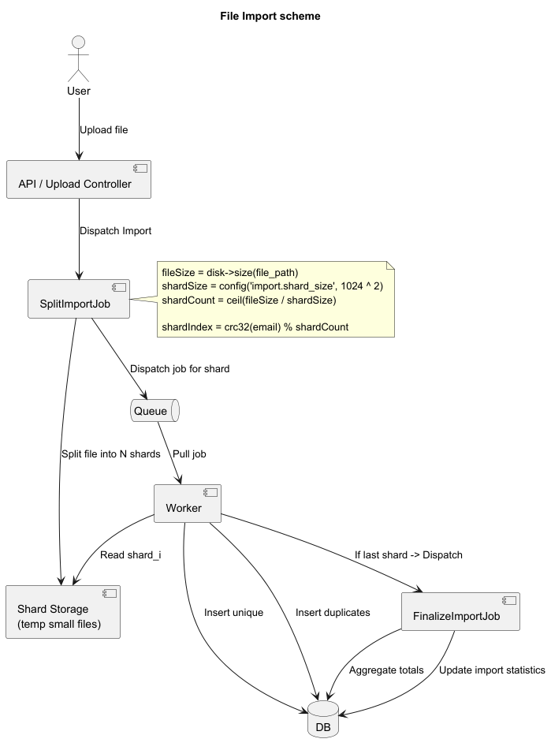
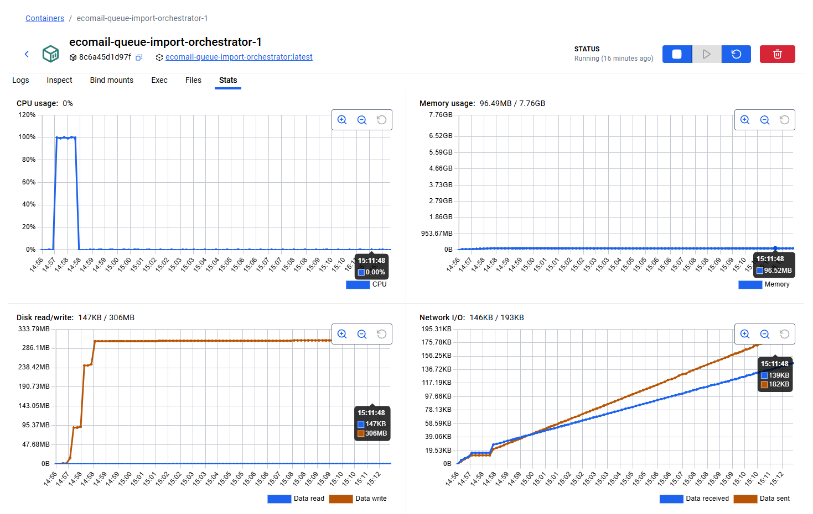
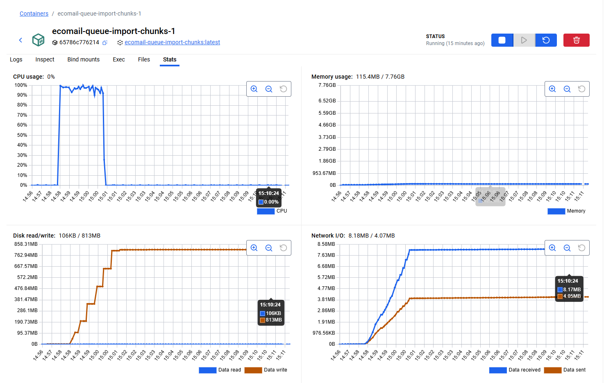

# ta.ecomail

Aplikace slouží ke správě seznamu kontaktů (jméno, příjmení, unikátní e-mail s RFC validací). Umožňuje vytváření, zobrazení, úpravu, mazání i full-textové vyhledávání podle jména, příjmení a e-mailu.

Podporuje hromadný import kontaktů s důrazem na efektivitu a kontrolu duplicit a nevalidních záznamů. Po dokončení importu zobrazuje přehled statistik včetně celkových počtů a času zpracování.

### Otázky pro zadavatele

1. Která databáze je preferovaná?
2. Můžeme používat fronty (RabbitMQ, Redis)?
3. Očekávají se v rámci testovacího úkolu i testy?
4. Je povoleno používat nástroje pro fulltextové vyhledávání?
5. Můžeme počítat s dostatečným místem na disku serveru pro zrychlení zpracování importu?
6. Existuje horní limit pro objem dat? Jaký objem dat se očekává průměrně?
7. Je struktura XML souboru pevně daná? Plánuje se do budoucna podpora souborů od jiných dodavatelů s jinou strukturou?
8. Jaké chování se očekává při poškozeném nebo strukturálně nesprávném XML souboru?
9. Pokud email už existuje v databázi při importu, máme data kontaktu aktualizovat, nebo záznam přeskočit?
10. Co se považuje za duplicitní záznam v reportu z importu: pouze duplicity uvnitř samotného souboru, pouze kolize s existujícími daty v databázi, nebo obě situace?
11. Můžeme zjednodušit validaci emailu pro rychlejší zpracování? Přísná validace podle RFC je pomalejší než například funkce filter_var, ale nepodporuje UTF-8 v části localname adresy.

### Import visuals

**Import processing scheme**  


## Run results

**100k run resource usage**  



**Import results**  

`\App\Services\Import\ChunkProcessor::validate`
```php
// Laravel Validator is too slow for this case.
// Tests showed that replacing Validator::make with simple native PHP checks
// makes the process about 3 times faster and uses 15% less memory.
//
// We use filter_var and strlen for basic validation,
// BUT, the email check is not exactly the same as Laravel 'email:rfc' rule.
//
// This is a topic for discussion: what is matters more to us.
$validator = Validator::make($record, [
    'email' => ['required', 'string', 'max:255', 'email:rfc'],
    'first_name' => ['required', 'string', 'max:255'],
    'last_name' => ['required', 'string', 'max:255'],
]);
```

## Requirements

- Docker
- Docker Compose
- Git

## Technology Stack
- Nginx - web server
- PHP-FPM - application runtime
- MariaDB - relational database
- RabbitMQ - message broker
- Meilisearch - full-text search engine
- Docker, Docker Compose - containerization and service orchestration

## Quick Start

Clone the repository, install and initialize the full environment (build, start, dependencies, migrations):

```bash
git clone git@github.com:taranovegor/ta.ecomail.git
cd ta.ecomail
make install
```

Application can be accessed at [http://localhost](http://localhost).

## Container Management

Start the application in background mode:

```bash
make up
```

Stop and remove containers:

```bash
make down
```

Check the status of all services:

```bash
make ps
```

View logs in real time (press Ctrl+C to exit):

```bash
make logs
```

## Database

Apply pending migrations:

```bash
make migrate
```

Reset the database and load test data:

```bash
make fresh
```

Populate the database using seeders:

```bash
make seed
```

## Dependencies

Install PHP dependencies:

```bash
make composer ARGS='install'
```

Install JavaScript dependencies:

```bash
make npm ARGS='install'
```

Build frontend assets:

```bash
make npm ARGS='run build'
```

## Application

Execute Laravel artisan commands:

```bash
make artisan ARGS='command:name'
```

Launch the interactive REPL:

```bash
make artisan ARGS='tinker'
```

## Architecture

The project uses Docker Compose to orchestrate multiple services: web application, database, cache layer, and queue worker. Separate configurations are provided for development (`compose.dev.yaml`) and production (`compose.prod.yaml`) environments.

## Environment

Switch between environments using the ENV variable:

```bash
ENV=prod make build
```

```bash
ENV=dev make up
```

Development mode is used by default.

## Troubleshooting

If errors occur, check the service logs. For a complete reinstall, perform cleanup and rebuild:

```bash
make down
```

```bash
make rebuild
```

```bash
make up
```

The `rebuild` command rebuilds images without using cache, which is useful when dealing with stale dependencies.

View the complete list of available commands:

```bash
make help
```

## Additional Commands

Build images (without starting containers):

```bash
make build
```

Open a bash shell inside the workspace container:

```bash
make bash
```

### Checks & Formatting

PHPStan static analysis:

```bash
make phpstan
```

Code formatting (Pint):

```bash
make pint
```

Check formatting without applying changes:

```bash
make pint-check
```

Run all formatting tasks:

```bash
make format
```

Run all checks at once:

```bash
make lint
```

### Tests

Run tests:

```bash
make test
```
